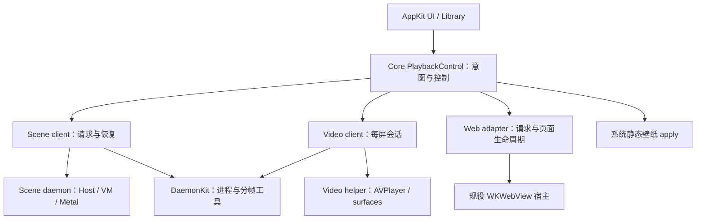

# MyWallpaperX 重构执行档案

<!-- document-role: active-plan -->

> 状态：现役工程重构计划；已完成调查、生命周期设计及源码／文档职责重排；E0 性能基线和下述运行时成本消融尚未执行。
>
> 基点：2026-09-15，`a7863c3e0bf5c2d7f134c7378aff1d13424a5c10`，调查开始时工作区干净。
>
> 范围：Scene 从准备、状态更新、合成到播放的执行成本；App/Video/Web/Scene 控制边界；测试与文档消融。沿用已有路径，不新增并行工程计划。
>
> 权威：本文决定工程批次和退役门；[兼容路线](scene-compatibility-roadmap.md)决定作者能力与样本验收，不要求等 P5 才测性能。两者冲突时保留正确画面和安全边界，调整实现与工作顺序，不冻结旧方案。长期合同变更与 owner 迁移同批落入各自权威文件。
>
> 退役：E0–E8 完成或有证据裁决不适用、旧职责撤权、当前文档收敛、性能与恢复门通过后，终态归长期合同，本文转历史。

## 1. 执行摘要

**保留已经成立的底座；先降低材质 admission 与帧状态构造成本，再按测量结果优化 GPU 和调度。每个替代必须交付一份删除清单。** 不整体换语言、不再做一次 daemon 化、不先搭完整新框架，不以切文件或增加缓存数量作为进展。

启动阅读：本节 → §3 目标设计及其链接的逐对象生命周期合同 → §5 当前执行卡。具体证据只按 §2 的索引查找；文档与测试处置查 §6。不要在每批开工时重读全部资料。

| 顺序 | 批次 | 结果 | 当前状态 |
|---|---|---|---|
| 先做 | E0 基线与验收修复 | 普通签名播放的成本归因、独立正反门、可比较输入 | 未执行 |
| 首个代码批次 | E1 admission 与帧存储 | 少构造、少复制、少重推导；一帧共享必要投影 | 待 E0 |
| 与 E1 分开 | E2 控制与产品依赖 | 唯一切换意图；公共控制层不依赖 Scene 实现；Shared 不调用模块 singleton | 可先做静态边界设计 |
| E1 后 | E3 GPU 合成与资源 | 减少无必要的 pass、主 target 往返和临时驻留 | 待 GPU 归因 |
| 条件执行 | E4 调度与多屏提交 | 有背压、不重复尝试、明确不可回滚的 GPU 提交点 | 正常模式有等待证据再启用 |
| 独立切片 | E5 shader 语义收敛 | 一族结构化语义替代一族源码形状 matcher | 待选择最有价值的一族 |
| 伴随上述批次 | E6 测试与依赖减重 | 保留行为／安全证据，减少重复编译和内部结构锁定 | 已完成路径与编译源集合维护；编译成本消融未执行 |
| 现在起持续 | E7 文档减重 | 一个工程入口、短当前表、研究与历史按需读取 | 入口、生命周期合同、源码职责导航与旧计划归档已完成；大型台账逐条消融仍开放 |
| 最后 | E8 产品验收 | 普通播放、交互、资源、恢复、发布边界可复核 | 待前置闭合 |

## 2. 调查基线与证据边界

详见[重构调查与退役清单](design/refactor-baseline.md)。执行顺序只由本计划 §5 维护。

## 3. 目标设计：少数责任清楚的边界

这些是本计划的项目设计选择，不声称复刻 WE 私有内部架构。逻辑模块先在现有目录内收敛；新增 Swift target/package 只在依赖边界稳定且构建测量证明值得时进行。

### 3.1 产品控制面与进程



- **App** 持久化用户选择与属性，创建一个跨 runtime 的切换 epoch；adapter 保存执行事实，UI 显示投影。Library 保留索引、历史与下载事务，不再决定异步 runtime 完成能否覆盖新选择。
- **PlaybackControl** 收敛既有切换路径。优先改造已有 owner，不新增与 WallpaperManager／WallpaperEngine 并存的永久协调器。迁移后 multiplexer 只分发；意图权威只有一个。
- **Scene client** 只持有可重放 authored intent、request/record/revision、显示配置及恢复状态；frame、纹理、VM 和 GPU 不跨 IPC。
- **Scene daemon** 保持现役同二进制 accessory 模式。拆独立 binary、搬 render thread、Web daemon 化均不是当前必做项。
- **Video／Web** 保留 AVFoundation 和 WebKit 专属生命周期；“共享控制”不意味着共用 shader graph、帧时钟、媒体 decoder 或窗口实现。
- **Shared** 只保留可复用视图／值与注入接口；具体库和服务行为在 App composition root 装配。公共状态工具在 Core，不能由 Shared/UI 反向指挥 Modules。

切换事务目标：`request(epoch) → prepare candidate → 可呈现确认 → commit active projection → retire previous`。失败保留旧可见输出是目标；当前跨 runtime 的通知式先停后开不冒充已经满足。迁移在单一切换入口完成，不能为了保留旧画面暗中保留两个 active owner；若受平台限制必须短暂空窗，明确产品策略与验收界限。

### 3.2 Scene 播放器的逐对象设计与写法

永久执行合同只维护在[运行时架构 §8：Scene 播放生命周期与落代码合同](design/runtime-architecture.md#8-scene-播放生命周期与落代码合同)，不在计划中复制第二份。

- 六个阶段规定装载、准备、激活、帧更新／资源发布、合成／呈现、退场分别可以做什么。
- 生命周期矩阵覆盖纹理、mip／sprite、材质、effect、target/history、named provider、文字、视频、图片、粒子、Puppet／3D、utility、相机／灯光、属性／Timeline、脚本、输入／音频／媒体、sound 与诊断：明确何时加载、每帧更新、合成位置与释放。
- 单帧顺序明确 VM 前后 snapshot、最终 pose、provider readiness、GPU producer→consumer、提交与 actual present；异步文字不能伪报同帧更新。
- 编码落点表规定新增字段、参数、脚本 API、粒子组件、provider 和坐标行为各应修改谁，以及禁止的旁路。
- 每批在现有任务描述填“输入→准备→当帧值→consumer→释放＋失效／反例”；不再新建一份设计文档。

E1/E3/E4/E5 必须按该合同交付纵向结果。尚未支持的类型不因表格列出就变成已支持；当前差距由合同 §8.6 和能力台账表述，不能拿目标结构冒充现状。

## 4. 性能与验收设计

### 4.1 E0 的测量协议

沿用现有 benchmark、counter、signpost 和签名流程，不新建常驻 profiling 平台。采集分为两次：普通播放测性能；开启证据窗口验证语义。不同模式数字不混算。

| 组 | 选材／目的 | 不能替代的边界 |
|---|---|---|
| 简单基线 | 现有 1300076567 候选；先复核该输入实际链 | 不能证明复杂 graph |
| 重 graph | 现有 2938612768 候选；记录实际 variant／generic 路由 | 不把旧 fallback 模式与新签名模式比较 |
| History／多 pass／跨层 | 从 Fast Suite 已批准项和真实形状选；缺项需建立独立 fixture | 未批准不能写 Suite PASS |
| Script／Puppet／粒子 | 事件、parent、骨骼、模拟的代表内容，各有局部失败反例 | 不用两张静态截图证明持续行为 |
| 产品切换／多屏 | Video→Scene→Web→静态、快速 A→B→C、无 drawable、断连 | 区分 App、daemon、WebContent 的时间与内存 |

每个 before/after 同机器、OS、屏幕／缩放、分辨率、帧率档、内容 digest、路由、签名和优化级别；冷缓存与热缓存分开。默认至少三次成对运行；稳态观察至少 60 s，启动单独测，噪声大就延长，不用增大样本数掩盖变量失控。

记录 launch 各阶段、actual first-present、CPU update/admission/encode、drawable wait、GPU duration、present 间隔 p50/p95/p99、attempt/rendered/busy/dropped、分配／复制、锁持有、draw/bind/encoder、target/copy 字节、进程与 GPU 高水位。现有 hub 累计均值不能当 p95；1Hz latest-only IPC 不能还原逐帧分布，分位数从诊断采集或短期 Instruments 得到。

采集前校准事件语义：FrameDriver 的 hub `firstVisibleFrame` 在 `.rendered`（提交成功）分支记账，不等于屏幕已经呈现；首帧延迟使用 daemon 的实际 drawable presented 事件。GPU completed、已提交和 actual present 分列，不能互相代替。

性能目标先用 E0 定标：60/30 FPS 对应 16.67/33.33 ms 呈现预算，这是目标而非现有达标事实。每类目标设备冻结绝对预算后再执行；不得要求任意复杂作者内容都无条件达到 60 FPS。

保留优化的门：原错误反例通过、画面／事件容差不退、p95/p99 与内存不出现超出基线噪声的回退、目标成本下降超过测量噪声。若只减少代码且无可辨性能变化，报告“结构消融”；禁止宣称运行加速。两次有区分力实验仍无收益或不改变首断点，停止该方向并更新裁决。

### 4.2 验证入口与边界

在仓库根运行，下列路径是本档案基点已验证存在的入口；后续先复核 help／selection，再执行。路径可以重复传入，不能用一个代表文件隐瞒实际改动面。

```bash
# 先预览实际选择，不构建、不跑样本。
python3.12 -B script/verify_scene_change.py --phase inner --base HEAD \
  --path MyWallpaperX/Core/SteamWorkshopScene/Rendering/Frame/SceneResolvedMaterialFramePreflight.swift

# 只运行明确模块；不要叠加 keyword 把范围扩大。
python3.12 -B script/run_scene_tests.py --scope scene \
  --module test_scene_dynamic_snapshot --module test_scene_plan_validation_identity

# 纯文档批的结构与链接门。
python3.12 -B script/run_scene_tests.py --scope scene \
  --module test_document_role_index --module test_scene_governance_contract \
  --module test_scene_semantics_coverage
```

Swift 改动在 checkpoint 使用现有 selector/build；`run_checkpoint_build.sh` 是无签名 Debug 构建门，不证明正式 shader backend 路由。可见／性能结论另绑定签名 staged App 和隔离内容。integration 需向 selector 明确提供 `--app` 可执行文件、`--sample-root` 隔离根、`--sample-id` 和 `--output-dir`。CI 没有私有 corpus，可跑自有 fixture，不声称 runtime PASS。

## 5. 可直接交接的执行卡

每卡完成必须同时给出：移交的 owner、删掉的旧职责、最小正反证据、before/after、剩余限制。成本消融或能力迁移不能只交付目录移动、编译通过或新协议。纯目录维护以文件内容守恒、源集合与工程引用完整作为完成门，不能据此关闭 E0/E1/E3/E4 的性能或行为目标。下面类型族边界用于选路径；实际 owned paths 在每批开工时展开核对，不授权宽泛覆盖。

### E0 — 建立可信基线与最小回归集

- **依赖／入口：**无。先核对普通 Scene client→daemon 路由；按 §4 从 Fast Suite 机器合同中选择已批准成员。`selection-required` 不可执行；没有合适的已批准成员时使用隔离 representative-content 并如实标注，不冒称 Suite PASS，不从全 corpus 扫描开始。
- **工作：**刷新简单／重 graph 两类正常签名基线，分离 cold launch 和稳态；按需要补 history、跨层、VM／粒子反例。给既有 matrix 失败逐条分类为产品缺陷、期待过时、未支持或环境，不改期待来“全绿”。
- **交付：**短性能表、构建与输入 identity、首要成本排序、可执行正反 case；数据写入现有证据 owner，本文只更新 E0 状态与链接。
- **消融：**撤销使用 unsigned/fallback/debug 数字推断普通产品性能的结论；不删除旧失败现场。
- **门／退出：**至少三次可比较结果；明确 route；counter 均值与分位数分开。若不能定位 CPU/admission/GPU/wait，先补最小观测，不进入全面改写。

### E1 — 压缩 admission 与帧存储（第一优先）

- **依赖／入口：**E0 指向 CPU admission 或分配；F4–F7、FrameDriver、TextureRegistry、GraphExecutor Preparation/Validation、Program finalizer。
- **E1a：**将 visibility、active closure、mutation grouping 收到同 surface/frame/phase 的已有投影；预检消费投影而不是重新从原始 descriptor 求值。覆盖动态增删层、隐藏 provider、parent／attachment 与 camera 差异。
- **E1b：**固定 request／command 的静态骨架和整数索引；帧内填参数、资源与 lease。复用有界 scratch 存储，优先消除实测大量复制的字典；coordinator 仍持有唯一提交权。
- **E1c：**把静态 ABI／graph 证明移到生成边界；live texture、function target、extent、epoch、pin 仍核验。不要跨 commandBuffer 缓存 PreparedGraph／PreparedPass。
- **消融：**旧重复求值函数／请求构造分支被替代后删除；移除同一字段多份持久状态。单纯新增 cache 而旧构造仍执行不算完成。
- **门：**`test_scene_dynamic_snapshot`、`test_scene_dynamic_layer_visibility`、`test_scene_layer_world_frame`、`test_scene_plan_validation_identity`、`test_scene_resolved_material_graph_executor`，再由 selector 加相关模块；同输入画面与 next-frame；admission／allocation A/B。
- **退路：**以这一职责的旧直接路径整体回退；不保留永久布尔开关。generation／wrong texture／history counterexample 失败立即撤回优化。

### E2 — 收敛控制意图与公共依赖

- **依赖／入口：**可独立于 E1，不能混一个提交；Application、PlaybackControl、WallpaperManager application/persistence、WallpaperEngine、SceneDaemonClient、Web launch、Shared Settings／runtime switch。
- **E2a：**画出唯一 intent epoch 与 requested/prepared/visible/stopped 状态归属；将当前通知式 switch 与旧 autoplay gate 的副作用集中到既有产品选择边界，UI 和库只发命令。
- **E2b：**公共 pause/resume/mute/profile 与 Scene 专属 load/property 分清。Scene payload 留领域边界；可提升的纯属性值需两个真实消费者并迁移原定义，不能用 Any／JSON 隐去类型约束，也不能新增通用命令平台。
- **E2c：**补全 Web 命令消费语义与 capability；撤销 video handler 间接重复操控 Web 的路径。systemStill 保持明确 apply owner。
- **E2d：**Settings 缓存动作与 ImportedVideoAutoplayGate 由 App 装配注入／选择 owner 执行；删 Shared 对 Modules 的直接 singleton 调用。先按动作归责，不机械移动全文件夹。
- **消融：**重复 active/mute/pending 真值、身份不足的定时清 pending（只有 correlated terminal 接管后）、旧 switch 通知副作用入口。
- **门：**`test_playback_command_multiplexer`、`test_scene_daemon_client_wiring`、`test_scene_daemon_protocol` 及 selector 的 transport/Web 门；A→B→C 逆序完成、属性拒绝重载、旧进程消息、快速 stop、Video/Web/Scene/静态互切。
- **退路：**按 runtime adapter 原子撤权回退；不能同时注册新旧消费端。不得以新增 coordinator 但原选择者继续写状态作为交付。

### E3 — 合成 pass 与资源生命周期

- **依赖／入口：**E0 GPU／copy／驻留证据；E1 不必全做完，但避免同时改同一事务。MainPassEncoder、ImageLayerCompositor、GraphTargets／Offscreen pool、Dependency preparation。
- **工作顺序：**记录 pass 与纹理读写寿命 → 先消除可证明多余的 full-frame copy／capture → 合并合法相邻主 pass → 在现有池内复用不重叠临时 target。每种成本独立实验。
- **消融：**多余 capture、无消费者 store、重复 target 与已撤权 coverage 路径；不得删除最后呈现所需 store，不盲改 loadAction。
- **门：**`test_scene_offscreen_texture_pool`、`test_scene_resolved_material_pass_encoder`、`test_scene_resolved_material_graph_executor`、`test_scene_shader_color_contract`；背景读取、透明叠色、copy/swap/history、精确 Puppet extent、预算溢出、mid-pass failure 的组合反例。
- **退出：**GPU／带宽或驻留下降且 ROI／事件不退；CPU 降了但新增 GPU 往返必须报告。失败回原 graph 排程，不新设 compositor fallback。

### E4 — 条件性调度与多屏事务

- **重启条件：**普通签名播放证实 busy/wait/pacing 占显著成本；只在 evidence readback 下出现 busy 不满足。先读旧 completion 唤醒失败实验，不重复原假设。
- **E4a：**先将与 drawable 无关的 CPU 准备前移，测试 missing drawable 的未提交回滚；不必立即改变 Timer。
- **E4b：**如需要重排节奏，设计唯一待调度 token，completion 只释放容量／标记可用，不直接递归 render。deadline 与 completion 合流只触发一次 attempt；暂停／停止撤销 token。
- **E4c：**先验证 all-surface 屏障部分提交；需要 per-surface 呈现时，再迁移共享 simulation version 与每屏输出版本。主线程迁移需 VM thread-affinity、窗口线程和 completion 锁顺序共同验收。
- **消融：**有证明后删除轮询或重复唤醒入口；未触发重启条件可裁决“保留当前调度”，不是拖欠一项必须重写的工作。
- **门：**正常模式 attempts 不放大、history 不读写冲突、某屏缺 drawable 不伪回滚已提交帧、脚本／鼠标事件不重复、暂停／断连／热插拔／GPU failure 后正确恢复。
- **退路：**同一 scheduler owner 回原策略；不得仅调大 in-flight 上限或删除 busy guard。Apple 的[动态缓冲 ring 原则](https://developer.apple.com/library/archive/documentation/3DDrawing/Conceptual/MTLBestPracticesGuide/TripleBuffering.html)不能替代本项目 history 证明。

### E5 — shader 语义压缩

- **依赖／入口：**从频繁失败／增长最多的一族选，不重写所有 shader。ShaderFrontend、ShaderPreparation、Program finalizer、现役 compiler helper。
- **工作：**颜色／数据纹理用途、alpha 表示和边界转换在已有 IR／编译流程形成明确事实；等价表达式走同一 lowering。先覆盖一个 bounded family，再扩大。
- **消融：**被替代的 analyzer／normalizer／generated-source matcher 成族删除；老 tests 中仅检查变量名和源码段的预期改成输入输出语义与拒绝反例。
- **门：**`test_scene_shader_color_contract`、`test_scene_generic_shader_program_artifact`、`test_scene_resolved_material_program_finalizer`；至少多个等价写法／未见组合，数据纹理不误做颜色转换、slot hole 不丢失、编译失败局部降级；实际 GPU／ROI。
- **退出：**一族作者语义由更少 primitive 覆盖，旧实现可从产品撤除。新增自研全语言 AST 平台却不能退休旧 matcher 时停止扩张。

### E6 — 测试与构建减重

- **入口：**scene_validation_gates、scene_swift_source_sets、source_layout、tests 下嵌入式 Swift harness、check_code_health、CI。
- **工作：**按“独立行为／安全反例／装配检查／实现耦合”归类；先测最慢模块编译占比。共享已存在的 source-set 与 fixture support，避免一个 test import 另一个 test 再拼大段 stub 的依赖链。
- **消融：**只删除证明已由独立行为门替代的重复内部断言／过期 fixture；安全和视觉反例保留。统一 source list 真值后撤销手写镜像；不得把选择器改成漏测来提速。
- **缓存条件：**若引入 harness 编译缓存，key 必含源码、harness、flags、SDK、编译器、架构和依赖内容；损坏重编，不能复用旧测试二进制冒充当前源码。
- **结构门：**19 个现有 code-health errors 分派到实际职责批次；只对已删除／迁移旧路径收缩 baseline，不抬高 800 上限。1536 行 Settings 按设置状态与动作消费者归责，先删耦合后拆 UI。
- **门：**`test_scene_swift_source_sets`、`test_verify_scene_change`、`test_scene_test_runner`、`test_check_code_health`；selected modules 与 old/new fixture 行为覆盖对照；记录冷／热测试时间。
- **退出：**相同保护面更快、少 stub／少重复编译；行数下降但覆盖丢失不合格。产品 target 拆分后置，不能与大规模 owner 迁移同批。

### E7 — 文档消融

按 §6 精确表执行，先把当前权威变短并修 consumer，再归档或删除。不得增加一个覆盖所有主题的总台账；本计划的证据快照不继续追加运行日志。

完成门：当前入口一跳定位职责，下一任务只在本文或兼容路线各自范围中出现；机器清单仍可生成；旧 anchor 有替代；文档门通过。历史实体删除按 AGENTS.md 列精确清单并确认，不因“已在 Git”就自动清空。

### E8 — 集成与关闭

- 普通 App 请求路径，30/60 档，冷启动／热切换／暂停／恢复、daemon 崩溃／断连、显示器变化、退出 drain；各 runtime 只输出自己的当前请求。
- 更新 E0 基线并解释所有回退；两档各至少 30 分钟长稳为起点，内存／GPU／事件队列无持续增长。缺多屏设备或官方对照则明确未验收，不能默认通过。
- full matrix 的旧期待与产品缺陷已区分；不把 non-black／compile success／route count 当视觉验收。Fast Suite 未批准项不冒充通过。
- 代码 owner／旧路径清零，现役文档接管终态，code-health errors 清零或明确仍阻止工程关闭。签名／公证独立发布门，完成重构不代表发布完成。

## 6. 代码、测试与文档的退役清单

详见[重构调查与退役清单](design/refactor-baseline.md)。执行顺序只由本计划 §5 维护。

## 7. 停止条件、风险与续跑

**必须停下纠偏：**出现第二输出 owner／registry／clock；缓存跳过 live identity；取消后仍发布旧请求；为了指标降分辨率或跳过层；用源码内部字符串断言替代视觉证据；新增通用框架却不能删除旧职责；研究原始表达与当前实现职责重叠。

**不预先承诺的设计：**全引擎 C++／Rust、独立 Scene executable target、Web daemon 化、全部图全局重排、多屏异步呈现、history triple buffering、GPU 粒子、持久化 PSO archive。只有对应测量／语义问题触发才另作有界裁决。

每批续跑只保留一个短记录：`当前卡 → frozen source/owned paths → 已交付行为 → before/after → 旧职责撤销 → 未验证边界 → 下一首断点`。结果归现有证据 owner，本文只更新状态与指针，不恢复 M0–M6 式流水账。

优先完成 E0，然后 E1a；若 E0 证明其他项明显主导，写一条含测量与影响面的裁决即可改变 E1/E3/E4 顺序。安全与唯一 owner 不变，现有方案与本文的工程顺序都不是不能被证据推翻的教条。
