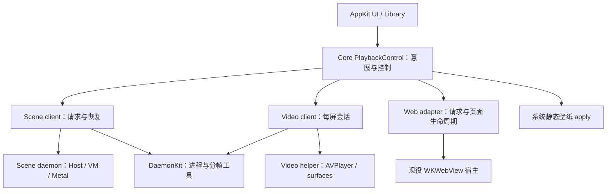

# MyWallpaperX 重构执行档案

<!-- document-role: active-plan -->

> 状态：现役工程重构计划；已完成调查、生命周期设计、源码／文档职责重排及 AS0 平台工程切片；AS0 最低设备与可见输出矩阵、E0/AS1 性能基线及下述运行时成本消融尚未执行。
>
> 基点：2026-09-15，`a7863c3e0bf5c2d7f134c7378aff1d13424a5c10`，调查开始时工作区干净。
>
> 范围：Scene 从准备、状态更新、合成到播放的执行成本；App/Video/Web/Scene 控制边界；测试与文档消融。沿用已有路径，不新增并行工程计划。
>
> 权威：本文决定工程批次和退役门；[兼容路线](scene-compatibility-roadmap.md)决定作者能力与样本验收，不要求等 P5 才测性能。两者冲突时保留正确画面和安全边界，调整实现与工作顺序，不冻结旧方案。长期合同变更与 owner 迁移同批落入各自权威文件。
>
> 退役：E0–E8 完成或有证据裁决不适用、旧职责撤权、当前文档收敛、性能与恢复门通过后，终态归长期合同，本文转历史。

## 1. 执行摘要

**保留已经成立的底座；先固定平台边界并测量，再降低 admission、资源与合成的实际主导成本。每个替代必须交付一份删除清单。** 不整体换语言、不再做一次 daemon 化、不先搭完整新框架，不以切文件或增加缓存数量作为进展。

Apple Silicon 专项从 [§8](#apple-silicon) 开始：按顺序执行，逐卡验收；这是 E0–E8 的细化，不增加第二条工程路线。

启动阅读：本节 → §3 目标设计及其链接的逐对象生命周期合同 → §5 当前执行卡。具体证据只按 §2 的索引查找；文档与测试处置查 §6。不要在每批开工时重读全部资料。

| 顺序 | 批次 | 结果 | 当前状态 |
|---|---|---|---|
| 先做 | E0 基线与验收修复 | 普通签名播放的成本归因、独立正反门、可比较输入 | 未执行 |
| CPU 成本候选 | E1 admission 与帧存储 | 少构造、少复制、少重推导；一帧共享必要投影 | 待 E0 |
| 与 E1 分开 | E2 控制与产品依赖 | 唯一切换意图；公共控制层不依赖 Scene 实现；Shared 不调用模块 singleton | 可先做静态边界设计 |
| E0 后按归因 | E3 GPU 合成与资源 | 减少无必要的 pass、主 target 往返和临时驻留 | 待 GPU 归因 |
| 条件执行 | E4 调度与多屏提交 | 有背压、不重复尝试、明确不可回滚的 GPU 提交点 | 正常模式有等待证据再启用 |
| 独立切片 | E5 shader 语义收敛 | 一族结构化语义替代一族源码形状 matcher | 待选择最有价值的一族 |
| 伴随上述批次 | E6 测试与依赖减重 | 保留行为／安全证据，减少重复编译和内部结构锁定 | 已完成路径与编译源集合维护；编译成本消融未执行 |
| 现在起持续 | E7 文档减重 | 一个工程入口、短当前表、研究与历史按需读取 | 入口、生命周期合同、源码职责导航与旧计划归档已完成；大型台账逐条消融仍开放 |
| 最后 | E8 产品验收 | 普通播放、交互、资源、恢复、发布边界可复核 | 待前置闭合 |

## 2. 调查基线与证据边界

详见[重构调查与退役清单](design/refactor-baseline.md)。执行顺序只由本计划 §5 维护。

## 3. 目标设计：少数责任清楚的边界

这些是本计划的项目设计选择，不声称复刻 WE 私有内部架构。逻辑模块先在现有目录内收敛；新增 Swift target/package 只在依赖边界稳定且构建测量证明值得时进行。

### 3.1 产品控制面与进程



- **App** 持久化用户选择与属性，创建一个跨 runtime 的切换 epoch；adapter 保存执行事实，UI 显示投影。Library 保留索引、历史与下载事务，不再决定异步 runtime 完成能否覆盖新选择。
- **PlaybackControl** 收敛既有切换路径。优先改造已有 owner，不新增与 WallpaperManager／WallpaperEngine 并存的永久协调器。迁移后 multiplexer 只分发；意图权威只有一个。
- **Scene client** 只持有可重放 authored intent、request/record/revision、显示配置及恢复状态；frame、纹理、VM 和 GPU 不跨 IPC。
- **Scene daemon** 保持现役同二进制 accessory 模式。拆独立 binary、搬 render thread、Web daemon 化均不是当前必做项。
- **Video／Web** 保留 AVFoundation 和 WebKit 专属生命周期；“共享控制”不意味着共用 shader graph、帧时钟、媒体 decoder 或窗口实现。
- **Shared** 只保留可复用视图／值与注入接口；具体库和服务行为在 App composition root 装配。公共状态工具在 Core，不能由 Shared/UI 反向指挥 Modules。

切换事务目标：`request(epoch) → prepare candidate → 可呈现确认 → commit active projection → retire previous`。失败保留旧可见输出是目标；当前跨 runtime 的通知式先停后开不冒充已经满足。迁移在单一切换入口完成，不能为了保留旧画面暗中保留两个 active owner；若受平台限制必须短暂空窗，明确产品策略与验收界限。

### 3.2 Scene 播放器的逐对象设计与写法

永久执行合同只维护在[运行时架构 §8：Scene 播放生命周期与落代码合同](design/runtime-architecture.md#8-scene-播放生命周期与落代码合同)，不在计划中复制第二份。

- 六个阶段规定装载、准备、激活、帧更新／资源发布、合成／呈现、退场分别可以做什么。
- 生命周期矩阵覆盖纹理、mip／sprite、材质、effect、target/history、named provider、文字、视频、图片、粒子、Puppet／3D、utility、相机／灯光、属性／Timeline、脚本、输入／音频／媒体、sound 与诊断：明确何时加载、每帧更新、合成位置与释放。
- 单帧顺序明确 VM 前后 snapshot、最终 pose、provider readiness、GPU producer→consumer、提交与 actual present；异步文字不能伪报同帧更新。
- 编码落点表规定新增字段、参数、脚本 API、粒子组件、provider 和坐标行为各应修改谁，以及禁止的旁路。
- 每批在现有任务描述填“输入→准备→当帧值→consumer→释放＋失效／反例”；不再新建一份设计文档。

E1/E3/E4/E5 必须按该合同交付纵向结果。尚未支持的类型不因表格列出就变成已支持；当前差距由合同 §8.6 和能力台账表述，不能拿目标结构冒充现状。

## 4. 性能与验收设计

### 4.1 E0 的测量协议

沿用现有 benchmark、counter、signpost 和签名流程，不新建常驻 profiling 平台。采集分为两次：普通播放测性能；开启证据窗口验证语义。不同模式数字不混算。

| 组 | 选材／目的 | 不能替代的边界 |
|---|---|---|
| 简单基线 | 现有 1300076567 候选；先复核该输入实际链 | 不能证明复杂 graph |
| 重 graph | 现有 2938612768 候选；记录实际 variant／generic 路由 | 不把旧 fallback 模式与新签名模式比较 |
| History／多 pass／跨层 | 从 Fast Suite 已批准项和真实形状选；缺项需建立独立 fixture | 未批准不能写 Suite PASS |
| Script／Puppet／粒子 | 事件、parent、骨骼、模拟的代表内容，各有局部失败反例 | 不用两张静态截图证明持续行为 |
| 产品切换／多屏 | Video→Scene→Web→静态、快速 A→B→C、无 drawable、断连 | 区分 App、daemon、WebContent 的时间与内存 |

每个 before/after 同机器、OS、屏幕／缩放、分辨率、帧率档、内容 digest、路由、签名和优化级别；冷缓存与热缓存分开。默认至少三次成对运行；稳态观察至少 60 s，启动单独测，噪声大就延长，不用增大样本数掩盖变量失控。

记录 launch 各阶段、actual first-present、CPU update/admission/encode、drawable wait、GPU duration、present 间隔 p50/p95/p99、attempt/rendered/busy/dropped、分配／复制、锁持有、draw/bind/encoder、target/copy 字节、进程与 GPU 高水位。现有 hub 累计均值不能当 p95；1Hz latest-only IPC 不能还原逐帧分布，分位数从诊断采集或短期 Instruments 得到。

采集前校准事件语义：FrameDriver 的 hub `firstVisibleFrame` 在 `.rendered`（提交成功）分支记账，不等于屏幕已经呈现；首帧延迟使用 daemon 的实际 drawable presented 事件。GPU completed、已提交和 actual present 分列，不能互相代替。

性能目标先用 E0 定标：60/30 FPS 对应 16.67/33.33 ms 呈现预算，这是目标而非现有达标事实。每类目标设备冻结绝对预算后再执行；不得要求任意复杂作者内容都无条件达到 60 FPS。

保留优化的门：原错误反例通过、画面／事件容差不退、p95/p99 与内存不出现超出基线噪声的回退、目标成本下降超过测量噪声。若只减少代码且无可辨性能变化，报告“结构消融”；禁止宣称运行加速。两次有区分力实验仍无收益或不改变首断点，停止该方向并更新裁决。

### 4.2 验证入口与边界

在仓库根运行，下列路径是本档案基点已验证存在的入口；后续先复核 help／selection，再执行。路径可以重复传入，不能用一个代表文件隐瞒实际改动面。

```bash
# 先预览实际选择，不构建、不跑样本。
python3.12 -B script/verify_scene_change.py --phase inner --base HEAD \
  --path MyWallpaperX/Core/SteamWorkshopScene/Rendering/Frame/SceneResolvedMaterialFramePreflight.swift

# 只运行明确模块；不要叠加 keyword 把范围扩大。
python3.12 -B script/run_scene_tests.py --scope scene \
  --module test_scene_dynamic_snapshot --module test_scene_plan_validation_identity

# 纯文档批的结构与链接门。
python3.12 -B script/run_scene_tests.py --scope scene \
  --module test_document_role_index --module test_scene_governance_contract \
  --module test_scene_semantics_coverage
```

Swift 改动在 checkpoint 使用现有 selector/build；`run_checkpoint_build.sh` 是无签名 Debug 构建门，不证明正式 shader backend 路由。可见／性能结论另绑定签名 staged App 和隔离内容。integration 需向 selector 明确提供 `--app` 可执行文件、`--sample-root` 隔离根、`--sample-id` 和 `--output-dir`。CI 没有私有 corpus，可跑自有 fixture，不声称 runtime PASS。

## 5. 可直接交接的执行卡

每卡完成必须同时给出：移交的 owner、删掉的旧职责、最小正反证据、before/after、剩余限制。成本消融或能力迁移不能只交付目录移动、编译通过或新协议。纯目录维护以文件内容守恒、源集合与工程引用完整作为完成门，不能据此关闭 E0/E1/E3/E4 的性能或行为目标。下面类型族边界用于选路径；实际 owned paths 在每批开工时展开核对，不授权宽泛覆盖。

### E0 — 建立可信基线与最小回归集

- **依赖／入口：**无。先核对普通 Scene client→daemon 路由；按 §4 从 Fast Suite 机器合同中选择已批准成员。`selection-required` 不可执行；没有合适的已批准成员时使用隔离 representative-content 并如实标注，不冒称 Suite PASS，不从全 corpus 扫描开始。
- **工作：**刷新简单／重 graph 两类正常签名基线，分离 cold launch 和稳态；按需要补 history、跨层、VM／粒子反例。给既有 matrix 失败逐条分类为产品缺陷、期待过时、未支持或环境，不改期待来“全绿”。
- **交付：**短性能表、构建与输入 identity、首要成本排序、可执行正反 case；数据写入现有证据 owner，本文只更新 E0 状态与链接。
- **消融：**撤销使用 unsigned/fallback/debug 数字推断普通产品性能的结论；不删除旧失败现场。
- **门／退出：**至少三次可比较结果；明确 route；counter 均值与分位数分开。若不能定位 CPU/admission/GPU/wait，先补最小观测，不进入全面改写。

### E1 — 压缩 admission 与帧存储（CPU 热点成立时优先）

- **依赖／入口：**E0 指向 CPU admission 或分配；F4–F7、FrameDriver、TextureRegistry、GraphExecutor Preparation/Validation、Program finalizer。
- **E1a：**将 visibility、active closure、mutation grouping 收到同 surface/frame/phase 的已有投影；预检消费投影而不是重新从原始 descriptor 求值。覆盖动态增删层、隐藏 provider、parent／attachment 与 camera 差异。
- **E1b：**固定 request／command 的静态骨架和整数索引；帧内填参数、资源与 lease。复用有界 scratch 存储，优先消除实测大量复制的字典；coordinator 仍持有唯一提交权。
- **E1c：**把静态 ABI／graph 证明移到生成边界；live texture、function target、extent、epoch、pin 仍核验。不要跨 commandBuffer 缓存 PreparedGraph／PreparedPass。
- **消融：**旧重复求值函数／请求构造分支被替代后删除；移除同一字段多份持久状态。单纯新增 cache 而旧构造仍执行不算完成。
- **门：**`test_scene_dynamic_snapshot`、`test_scene_dynamic_layer_visibility`、`test_scene_layer_world_frame`、`test_scene_plan_validation_identity`、`test_scene_resolved_material_graph_executor`，再由 selector 加相关模块；同输入画面与 next-frame；admission／allocation A/B。
- **退路：**以这一职责的旧直接路径整体回退；不保留永久布尔开关。generation／wrong texture／history counterexample 失败立即撤回优化。

### E2 — 收敛控制意图与公共依赖

- **依赖／入口：**可独立于 E1，不能混一个提交；Application、PlaybackControl、WallpaperManager application/persistence、WallpaperEngine、SceneDaemonClient、Web launch、Shared Settings／runtime switch。
- **E2a：**画出唯一 intent epoch 与 requested/prepared/visible/stopped 状态归属；将当前通知式 switch 与旧 autoplay gate 的副作用集中到既有产品选择边界，UI 和库只发命令。
- **E2b：**公共 pause/resume/mute/profile 与 Scene 专属 load/property 分清。Scene payload 留领域边界；可提升的纯属性值需两个真实消费者并迁移原定义，不能用 Any／JSON 隐去类型约束，也不能新增通用命令平台。
- **E2c：**补全 Web 命令消费语义与 capability；撤销 video handler 间接重复操控 Web 的路径。systemStill 保持明确 apply owner。
- **E2d：**Settings 缓存动作与 ImportedVideoAutoplayGate 由 App 装配注入／选择 owner 执行；删 Shared 对 Modules 的直接 singleton 调用。先按动作归责，不机械移动全文件夹。
- **消融：**重复 active/mute/pending 真值、身份不足的定时清 pending（只有 correlated terminal 接管后）、旧 switch 通知副作用入口。
- **门：**`test_playback_command_multiplexer`、`test_scene_daemon_client_wiring`、`test_scene_daemon_protocol` 及 selector 的 transport/Web 门；A→B→C 逆序完成、属性拒绝重载、旧进程消息、快速 stop、Video/Web/Scene/静态互切。
- **退路：**按 runtime adapter 原子撤权回退；不能同时注册新旧消费端。不得以新增 coordinator 但原选择者继续写状态作为交付。

Steam 账号、订阅与下载获取的具体迁移由 [Steam 获取专项](scene-steamkit-migration-plan.md)细化 E2/E6/E8：只改变获取服务与 UI 衔接，不将获取命令混入播放 multiplexer，不改变本计划的工程优先级。

### E3 — 合成 pass 与资源生命周期

- **依赖／入口：**E0 GPU／copy／驻留证据；E1 不必全做完，但避免同时改同一事务。MainPassEncoder、ImageLayerCompositor、GraphTargets／Offscreen pool、Dependency preparation。
- **工作顺序：**记录 pass 与纹理读写寿命 → 先消除可证明多余的 full-frame copy／capture → 合并合法相邻主 pass → 在现有池内复用不重叠临时 target。每种成本独立实验。
- **消融：**多余 capture、无消费者 store、重复 target 与已撤权 coverage 路径；不得删除最后呈现所需 store，不盲改 loadAction。
- **门：**`test_scene_offscreen_texture_pool`、`test_scene_resolved_material_pass_encoder`、`test_scene_resolved_material_graph_executor`、`test_scene_shader_color_contract`；背景读取、透明叠色、copy/swap/history、精确 Puppet extent、预算溢出、mid-pass failure 的组合反例。
- **退出：**GPU／带宽或驻留下降且 ROI／事件不退；CPU 降了但新增 GPU 往返必须报告。失败回原 graph 排程，不新设 compositor fallback。

### E4 — 条件性调度与多屏事务

- **重启条件：**普通签名播放证实 busy/wait/pacing 占显著成本；只在 evidence readback 下出现 busy 不满足。先读旧 completion 唤醒失败实验，不重复原假设。
- **E4a：**先将与 drawable 无关的 CPU 准备前移，测试 missing drawable 的未提交回滚；不必立即改变 Timer。
- **E4b：**如需要重排节奏，设计唯一待调度 token，completion 只释放容量／标记可用，不直接递归 render。deadline 与 completion 合流只触发一次 attempt；暂停／停止撤销 token。
- **E4c：**先验证 all-surface 屏障部分提交；需要 per-surface 呈现时，再迁移共享 simulation version 与每屏输出版本。主线程迁移需 VM thread-affinity、窗口线程和 completion 锁顺序共同验收。
- **消融：**有证明后删除轮询或重复唤醒入口；未触发重启条件可裁决“保留当前调度”，不是拖欠一项必须重写的工作。
- **门：**正常模式 attempts 不放大、history 不读写冲突、某屏缺 drawable 不伪回滚已提交帧、脚本／鼠标事件不重复、暂停／断连／热插拔／GPU failure 后正确恢复。
- **退路：**同一 scheduler owner 回原策略；不得仅调大 in-flight 上限或删除 busy guard。Apple 的[动态缓冲 ring 原则](https://developer.apple.com/library/archive/documentation/3DDrawing/Conceptual/MTLBestPracticesGuide/TripleBuffering.html)不能替代本项目 history 证明。

### E5 — shader 语义压缩

- **依赖／入口：**从频繁失败／增长最多的一族选，不重写所有 shader。ShaderFrontend、ShaderPreparation、Program finalizer、现役 compiler helper。
- **工作：**颜色／数据纹理用途、alpha 表示和边界转换在已有 IR／编译流程形成明确事实；等价表达式走同一 lowering。先覆盖一个 bounded family，再扩大。
- **消融：**被替代的 analyzer／normalizer／generated-source matcher 成族删除；老 tests 中仅检查变量名和源码段的预期改成输入输出语义与拒绝反例。
- **门：**`test_scene_shader_color_contract`、`test_scene_generic_shader_program_artifact`、`test_scene_resolved_material_program_finalizer`；至少多个等价写法／未见组合，数据纹理不误做颜色转换、slot hole 不丢失、编译失败局部降级；实际 GPU／ROI。
- **退出：**一族作者语义由更少 primitive 覆盖，旧实现可从产品撤除。新增自研全语言 AST 平台却不能退休旧 matcher 时停止扩张。

### E6 — 测试与构建减重

- **入口：**scene_validation_gates、scene_swift_source_sets、source_layout、tests 下嵌入式 Swift harness、check_code_health、CI。
- **工作：**按“独立行为／安全反例／装配检查／实现耦合”归类；先测最慢模块编译占比。共享已存在的 source-set 与 fixture support，避免一个 test import 另一个 test 再拼大段 stub 的依赖链。
- **消融：**只删除证明已由独立行为门替代的重复内部断言／过期 fixture；安全和视觉反例保留。统一 source list 真值后撤销手写镜像；不得把选择器改成漏测来提速。
- **缓存条件：**若引入 harness 编译缓存，key 必含源码、harness、flags、SDK、编译器、架构和依赖内容；损坏重编，不能复用旧测试二进制冒充当前源码。
- **结构门：**19 个现有 code-health errors 分派到实际职责批次；只对已删除／迁移旧路径收缩 baseline，不抬高 800 上限。1536 行 Settings 按设置状态与动作消费者归责，先删耦合后拆 UI。
- **门：**`test_scene_swift_source_sets`、`test_verify_scene_change`、`test_scene_test_runner`、`test_check_code_health`；selected modules 与 old/new fixture 行为覆盖对照；记录冷／热测试时间。
- **退出：**相同保护面更快、少 stub／少重复编译；行数下降但覆盖丢失不合格。产品 target 拆分后置，不能与大规模 owner 迁移同批。

### E7 — 文档消融

按 §6 精确表执行，先把当前权威变短并修 consumer，再归档或删除。不得增加一个覆盖所有主题的总台账；本计划的证据快照不继续追加运行日志。

完成门：当前入口一跳定位职责，下一任务只在本文或兼容路线各自范围中出现；机器清单仍可生成；旧 anchor 有替代；文档门通过。历史实体删除按 AGENTS.md 列精确清单并确认，不因“已在 Git”就自动清空。

### E8 — 集成与关闭

- 普通 App 请求路径，30/60 档，冷启动／热切换／暂停／恢复、daemon 崩溃／断连、显示器变化、退出 drain；各 runtime 只输出自己的当前请求。
- 更新 E0 基线并解释所有回退；两档各至少 30 分钟长稳为起点，内存／GPU／事件队列无持续增长。缺多屏设备或官方对照则明确未验收，不能默认通过。
- full matrix 的旧期待与产品缺陷已区分；不把 non-black／compile success／route count 当视觉验收。Fast Suite 未批准项不冒充通过。
- 代码 owner／旧路径清零，现役文档接管终态，code-health errors 清零或明确仍阻止工程关闭。签名／公证独立发布门，完成重构不代表发布完成。

## 6. 代码、测试与文档的退役清单

详见[重构调查与退役清单](design/refactor-baseline.md)。执行顺序只由本计划 §5 维护。

## 7. 停止条件、风险与续跑

**必须停下纠偏：**出现第二输出 owner／registry／clock；缓存跳过 live identity；取消后仍发布旧请求；为了指标降分辨率或跳过层；用源码内部字符串断言替代视觉证据；新增通用框架却不能删除旧职责；研究原始表达与当前实现职责重叠。

**不预先承诺的设计：**全引擎 C++／Rust、独立 Scene executable target、Web daemon 化、全部图全局重排、多屏异步呈现、history triple buffering、GPU 粒子、持久化 PSO archive。只有对应测量／语义问题触发才另作有界裁决。

每批续跑只保留一个短记录：`当前卡 → frozen source/owned paths → 已交付行为 → before/after → 旧职责撤销 → 未验证边界 → 下一首断点`。结果归现有证据 owner，本文只更新状态与指针，不恢复 M0–M6 式流水账。

先落实 §8 的 AS0 平台政策，再完成 E0/AS1；CPU admission 主导时优先 E1a，否则按成本归因选择 E3/E4。写一条含测量与影响面的裁决即可改变顺序。安全与唯一 owner 不变，现有方案与本文的工程顺序都不是不能被证据推翻的教条。


<a id="apple-silicon"></a>
## 8. Apple Silicon 优化执行计划与验收

> 复核：2026-09-15，源码基点 `970a5645da8ffb6572717730d6a2cdb87315f402`。本节来自源码／配置与 Apple 公开资料审查；尚未执行性能实验，不代表已找到经测量确认的瓶颈。
>
> 平台目标以[长期技术边界](../architecture/technology-stack-boundaries.md#1-产品基线与迁移目标)为准。本节只管理待执行动作与验收，完成后结果归现有证据 owner、稳定设计归架构，不追加实验流水账。

### 8.1 执行顺序与范围

顺序为 **AS0 → AS1 → AS2 → AS3 → AS4 → AS5 → AS6 → AS7 → AS8 → AS9**。AS0 是政策落地，不需要先证明帧率收益；AS1 后，每卡先检查触发条件，不满足就记录“有证据不实施”并进入下一卡。AS1 如发现 CPU 或能耗成本明显主导，可把 AS5/AS6 前移，裁决写明测量、受影响 owner 和依赖。不得用“条件执行”跳过调查或验收，也不要求全部改造成新技术。

| 卡 | 对应工程卡 | 可交付结果 | 前置／优先级 |
|---|---|---|---|
| AS0 平台与工具链 | E6/E8 | arm64 发布合同可机器核验 | 先做；产品行为不变 |
| AS1 成本基线 | E0 | 相同画质下的 CPU/GPU/内存/能耗成本排序 | 所有性能实现前置 |
| AS2 上传与驻留 | E3 | 降低加载等待、静态纹理访问和重复驻留成本 | 首个资源实验 |
| AS3 合成与附件 | E3 | 减少不必要的 copy、store/load、pass 切换 | AS1 有 GPU/带宽证据 |
| AS4 统一内存预算 | E3/E2 | 多屏、切换、压力下资源有界 | 复用 AS2 的资源生命周期 |
| AS5 CPU 与几何 | E1 | 少构造、少复制；必要时 GPU skinning | CPU 热点成立后 |
| AS6 调度与功耗 | E4/E2 | 正常播放节奏稳定，暂停后停止无用工作 | 保持唯一时钟与提交权 |
| AS7 编译与 shader | E5/E6 | 降低已证实的启动编译或 shader 执行成本 | 单独冷启动／GPU 实验 |
| AS8 Video/Web/音频 | E2/E8 | 保留系统加速，缩减跨进程与转换成本 | 每个 runtime 独立归因 |
| AS9 集成与发布 | E8 | 最低设备、恢复、长稳和包体全部验收 | 前卡通过或明确不适用 |

跨卡不混提交。每卡先展开 owned paths；文中类型是检索入口，不是对整个目录的编辑授权。已有未支持的作者能力留在兼容路线，不通过降低内容复杂度、跳过 effect、降低分辨率或新增 fallback 制造性能收益。

### 8.2 AS0 — arm64-only 产品与依赖

**当前事实：**[Xcode 配置](../../MyWallpaperX.xcodeproj/project.pbxproj)未显式固定 ARCHS；[发行构建](../../.github/workflows/build.yml)未显式传架构；[shader 工具依赖清单](../../script/scene_shader_compiler_dependencies.json)已有 arm64 描述。项目配置与 target 配置存在 26.2/26.0 的 deployment 值；需查有效设置，不能从文本直接断言实际部署版本错误。

**实施：**App 与 WallpaperDaemon 的 Debug/Release 固定 arm64；检查 scheme、CI、嵌套 compiler/VM、Sparkle 与动态库。统一有效最低系统版本，撤销自有构建中仅为 Intel 存在的分支／产物；没有实际分支就不制造删除任务。禁用 Rosetta 开发依赖作为发布替代，不使用 `arm64e` 或开发机 `-mcpu=native` 缩窄设备覆盖。第三方 Universal 包可以保留，去除 slice 的体积收益另算并重新验证签名。

**验收：**未来执行 `xcodebuild -showBuildSettings` 核对所有产品配置；对实际发行 Mach-O 清单执行 `lipo -archs`，自有二进制只有 arm64，第三方均含 arm64；`otool -L` 无开发机专有依赖。最低支持设备原生启动 App、helper、compiler，完成一条 Scene 和 Video 输出；AS0 以配置、依赖和本地原生构建／启动门进入 AS1，正式签名、公证及发行包全矩阵延后到 AS9，不阻塞成本调查。交付 before/after 包体与构建时间，但不把去掉 Intel slice 记成 arm64 播放加速。

**当前结果（2026-09-15）：**App 与 WallpaperDaemon 的 Debug/Release 有效设置已固定为 `ARCHS=arm64`、最低 macOS 26.0，Release workflow 显式覆盖架构并在签名前执行机器门。当前无签名 Release `.app` 的 9 个 Mach-O 中，2 个自有二进制仅含 arm64，glslang、SPIRV-Cross 与 Sparkle 的 7 个第三方二进制均含 arm64；依赖及 `LC_RPATH` 未发现开发机绝对路径。配置变更的隔离冷构建 before/after 为 236.92 s／235.59 s，包体均为 163,864 KiB；约 0.6% 的时间差按单次测量记为噪声，不声明构建提速或包体收益。当前 M4 本机的 Release App 已原生存活 5 s 后主动终止；WallpaperDaemon 在主显示器完成 `launched → stdin EOF → stopped`，glslang 以 exit 0 回报 16.4.0，SPIRV-Cross 以其约定的 exit 1 回报 `vulkan-sdk-1.4.357.0`，均无进程残留。最低支持 M1、签名／公证包、当前构建的 Scene／Video 可见输出因设备与锁屏条件未验收，不能由本机配置门外推；AS1 只可开始不依赖这些外部门的基线准备。

### 8.3 AS1 — 冻结可比较的基线和验收阈值

复用 §4 的采集方式及事件定义。设备最低矩阵：M1 8 GB 或最低支持设备；另有一台较新 Apple Silicon 对照。缺设备时明确未验收，不能由高配机器推出低配通过。覆盖单屏 60 Hz、30 FPS 节能档及混合刷新率双屏；记录实际分辨率／缩放、供电、热状态、OS/Xcode、优化等级、签名、内容与路由 identity。低电量模式单独一组，不能混算。

| 工作负载 | 首要测量 | 必须包含的反例 |
|---|---|---|
| 静态图、BC/TEX、多 mip、大纹理 | 冷／热首帧、解码/上传时间、CPU/GPU 峰值 | 数据纹理、非整块尺寸、加载取消、坏资源 |
| 透明多层、背景读取、多 pass/history | GPU duration、附件读写量、encoder/copy 次数 | copy/swap、跨帧、局部失败、resize |
| Puppet、粒子、脚本、动态文字 | CPU 分项、分配/复制、顶点量、事件轨迹 | 隐藏后恢复、附件、动态增删、文本快速修改 |
| 视频与 Web、跨 runtime 切换 | 解码/转换、进程树内存、唤醒、首帧 | 循环、seek、mute、暂停、旧请求迟到 |
| 暂停、多屏、睡眠、内存压力 | wakeups、present 间隔、驻留平台与恢复时间 | 断屏、缺 drawable、唤醒、A→B→C |

**测试协议：**固定输入后至少三对 A/B，交替运行顺序；每次预热 30 s 后稳态记录至少 60 s，长动画至少覆盖一个完整周期。冷启动和应用缓存热启动各至少五次，报告每次值和中位数；五次启动不足以声称可信的启动 p95/p99。清冷缓存只针对隔离目录，不清系统全局缓存。先重复 baseline 得出噪声范围：对每个指标先取每次运行值（如该次 p95），噪声定义为各次值相对其中位数的最大偏差百分比；中位数为零时使用预登记的绝对误差门。主要计时指标噪声超过 5% 时先排除干扰或延长采集，不进入收益判定。温度漂移或其他进程干扰明显时作废重测。GPU Capture/validation 的时间不作为正常播放结果；截图及详细诊断另开语义验证窗口。[Apple 性能分析说明](https://developer.apple.com/documentation/xcode/optimizing-gpu-performance)

**阈值必须在优化前冻结。**下表是本项目拟采用的起始准入门，不是 Apple 标准或现有达标事实。AS1 可以根据噪声与最低设备调整一次并记录理由；不能在候选失败后放宽。

| 门 | 默认验收口径 |
|---|---|
| 有效收益 | 目标成本按每对 `(before-after)/before` 计算，再取配对降幅中位数，要求 ≥10% 且超过 baseline 重复运行噪声幅度的 2 倍；before 为零时改用预登记绝对门；报告所有运行值。不足则只能称结构改进，或结束实验 |
| 非目标指标 | CPU/GPU p95、present p99、首帧与峰值内存不得恶化超过 `max(5%, 2×该指标噪声)`；还必须满足 AS1 冻结的绝对预算，不能因噪声大自动放行 |
| 帧预算 | 为批准的内容／设备组合冻结 16.67 ms（60 FPS）或 33.33 ms（30 FPS）目标；分别检查 CPU、GPU 和 actual-present，不能把并行 CPU/GPU 时间简单相加。present 超过 1.5×目标间隔的比例默认 ≤1%，只统计按冻结策略应连续呈现的稳态窗口；暂停、按需静态、切换、缺 drawable 的故障注入单独验收，不计作普通播放掉帧。已有不达标内容单列债务，不能以相对改善宣称全局达标 |
| 画面与事件 | 预登记 ROI、采样帧／时刻、色彩空间和容差；确定性事件顺序、identity、publication 必须一致。颜色格式／精度改动需独立参考，不能只对比可能错误的旧画面；未冻结容差不得批准视觉变更 |
| 内存稳定 | 预热后 30 min 与 20 次切换／resize 后，资源 owner 数量无持续增长、旧 generation pin 最终归零；记录逻辑字节和进程 footprint，不能仅凭 allocator 未返还 RSS 判断泄漏或无泄漏 |
| 功耗 | 相同输出与供电／热条件下比较进程树 CPU time、wakeups 和可取得的能量计量；整机功率需控制背景负载，不把 Energy Impact 等级当瓦数，不能由 FPS 推断省电 |

同时保留 AS1 原始基线与每卡直接前驱，AS9 对原始基线重测总效果，防止每卡都在容差内却累计明显回退；热缓存命中集合、观察开销和实际运行路由必须可比。

**工具边界：**[scene_wallpaper_benchmark.py](../../script/scene_wallpaper_benchmark.py)当前默认 duration 为 7 s，并面向证据窗口，不能直接拿默认结果做稳态性能门。使用其 `--app`、`--sample-root`、`--sample-id`、`--output-dir`、`--duration` 做对应语义验证；`--performance-fps {30,60}` 必须显式传给 Debug runner，默认 60，并由运行日志回报实际档位，不能继承用户偏好后再在报告中硬编码身份。当前 Debug evidence telemetry 只在 drawable 即将提交时按 surface stream 注册 `addPresentedHandler`，用非零 `presentedTime` 计算 actual-present p50/p95/p99/max 与超过 1.5 倍目标间隔的比例；流数不等于 ready surface 数、首样本后没有区间或计数身份不闭合时整项 unavailable。正常播放另用现有 hub/signpost 与短期 Instruments。缺分位数或某项计数时标记 unavailable 并补最小采集，不虚构一个尚不存在的“性能 PASS 命令”。计数器不可把完整 graph hash/序列化放入普通帧。

### 8.4 AS2 — 纹理准备、异步上传与长期采样

**入口／事实：**[SceneImageTextureUploader](../../MyWallpaperX/Core/SteamWorkshopScene/Resources/Textures/SceneImageTextureUploader.swift)的静态图使用 shared、shaderRead+renderTarget，mipmap 后同步等待；[SceneCompressedTextureUploader](../../MyWallpaperX/Core/SteamWorkshopScene/Resources/Textures/SceneCompressedTextureUploader.swift)的 BC 归一化已使用 private/MPS，但仍同步等待。已有原生 BC、解码缓存和 [SceneTextureUploadCommandQueue](../../MyWallpaperX/Core/SteamWorkshopScene/Resources/Textures/SceneImageTextureUploader.swift)，不再另建上传系统。

**按三个独立实验实施：**①在现有 load/preparation 内按批合并上传、mip、转换，completion 才发布 ready，允许独立资源重叠；②比较静态资源 staging→private 与 shared+`optimizeContentsForGPUAccess`，按实际用途缩窄 usage；③ GPU ready 后，只保留重建／sprite 后续帧确需的 CPU 数据，避免解码图与 GPU 图无限期双驻留。Apple 的存储优化是机会，不保证每种纹理都会压缩或更快。[纹理优化接口](https://developer.apple.com/documentation/metal/optimizing-texture-data)

**合同：**最小资源单元维护 pending→ready/failed/cancelled；上传中 staging 保活且受预算约束；跨队列依赖显式成立。取消、换 generation、失败 completion 不得发布；不要在持锁时等待。纹理尺寸、mip 权威、purpose、alpha、UV、sampler、原生 BC 与数据通道语义必须保持。异步化如需改变返回合同，同批迁移 producer/consumer，不能同步 API 外包一层任务却仍逐项 wait。新路径先 observe-only（只观察），再 prefer-generic 验证，最后 generic-only 撤旧路；不静默双执行。

**验收：**AS1 的纹理组全部正反例；每个资源版本最多一次 ready publication、无 stale publication、GPU fault、过早释放或缺 mip 采样；量化 wait 次数/总时长、首帧、上传峰值与稳态 GPU 时间。收益必须覆盖额外 staging 峰值与转换成本。触达图像 mip 上传时补 failure completion 检查，不能提交失败仍当 ready。退出 GPU drain 的等待在 [Shutdown](../../MyWallpaperX/Core/SteamWorkshopScene/Runtime/Session/SceneDesktopWallpaperHost+Shutdown.swift)属于后台安全屏障，本卡不删除。

### 8.5 AS3 — Apple GPU 的合成与附件优化

**入口／事实：**[MainPassEncoder](../../MyWallpaperX/Core/SteamWorkshopScene/Rendering/Composition/SceneMainPassEncoder.swift)已复用兼容的主 encoder，但 offscreen 操作会结束它，颜色／深度默认 store，恢复主 pass 时 load；现有 target 池已使用 private。先在 prepared graph 标出 producer、consumer、最后使用与跨帧 pin，不在普通帧重算整图。

**实施顺序：**去掉无消费者的 snapshot/copy → 精确决定最后使用后的 depth/store → 合并合法相邻 pass → 在现有池中复用寿命不重叠 target。仅当附件完全限于一个 pass 且无需 load/store/后续采样时选择 memoryless；history、背景读取、跨层和后续 pass 输入不适用。heap aliasing、tile shader、programmable blending 仅在前述手段不足且证据证明收益时另开本卡子实验。[Apple 移植建议](https://developer.apple.com/documentation/apple-silicon/porting-your-metal-code-to-apple-silicon)、[memoryless 限制](https://developer.apple.com/documentation/metal/mtlstoragemode/memoryless)

**验收：**前后 graph 的作者顺序、读写版本和最终 store 一致；透明边缘、背景 effect、depth、copy/swap/history、mid-pass failure、resize、新组合均过 ROI/事件门。实测减少的 copy 字节／encoder／store 数必须能对应到具体被删除操作，GPU 时间或带宽收益过门；不能只报告理论字节。不得以关闭 Metal hazard tracking、扩大 in-flight 或跳过 final compositor 换速度。失败回同一 graph owner 的原安全排程。

### 8.6 AS4 — 全进程统一内存预算与退场

**事实：**[OffscreenTexturePool](../../MyWallpaperX/Core/SteamWorkshopScene/Rendering/Targets/SceneOffscreenTexturePool.swift)已有基于 `recommendedMaxWorkingSetSize / 32` 且带上下界的自动预算；[TextureLoader](../../MyWallpaperX/Core/SteamWorkshopScene/Resources/Textures/SceneTextureLoader.swift)已有默认 1 GiB 解码缓存预算和 lease。它们证明已有局部预算，尚不证明多 surface／候选会话总峰值受控。

**实施：**先实测同一资源被多个 surface、CPU cache、CVPixelBuffer 与 GPU target 引用时的物理／逻辑占用，再由已有 Host/resource owner 分配会话与 surface 预算。新增聚合账本只能收敛现有预算，不能成为第二资源 registry。`recommendedMaxWorkingSetSize` 是指导值，不是可用 RAM 或专属显存配额；不能与 RSS、每 surface device.currentAllocatedSize 简单相加。可重建 decode cache、未 pin 临时 target 优先回收；in-flight、history 当前版本、provider 正在被消费的帧必须等安全点。静态纹理跨屏复用只在相同 device、purpose、generation 与内容 identity 成立时做，资源共享不等于共享可变 renderer 状态。

**验收：**M1/低内存、双屏、大图、快速切换和受控压力测试；峰值不超冻结的会话／总预算，无 swap 持续增长或分配失败循环；旧 session 的 lease/pin/GPU 资源在完成后释放。压力后继续播放与重新准备可恢复、无旧纹理串屏。内存压力 fixture 先用确定性预算注入，不在用户系统主动耗尽内存。若共享成本超过收益，保留局部资源并记录界限。

### 8.7 AS5 — CPU 数据与 GPU 几何

**先执行 E1：**对 admission、字典投影、数组复制和锁持有做采样归因，复用既有 prepared 索引和有界 scratch；dynamic readiness、extent、epoch、publication 检查仍每帧有效。动态 buffer 保持适合统一内存的 shared 与 completion 保护的 ring，不因“GPU 优化”统改 private。静态文字仅在字体／文本／布局相关 revision 失效时重栅格化；先查实际调用频率，不假设当前每帧重绘。

**条件实验：**[PuppetAnimationEvaluator](../../MyWallpaperX/Core/SteamWorkshopScene/Systems/Puppet/ScenePuppetAnimationEvaluator.swift)在 CPU 遍历顶点变形，[PuppetPlaybackState](../../MyWallpaperX/Core/SteamWorkshopScene/Systems/Puppet/ScenePuppetPlaybackState.swift)复制到复用的顶点 buffer。若变形/复制占稳态 CPU ≥10% 且是主导可消融项，静态顶点/权重一次上传，CPU 保留骨骼和约束，GPU vertex skinning 只消费当帧矩阵。不得为了 bounds/attachment 每帧 GPU readback；先明确 CPU 的精确 bounds 或经证明安全的 bounds 策略，不能让合成裁剪错误。

**验收：**同时间／seed 的姿态、附件、bounds、透明边缘、动态骨骼覆盖、隐藏再显示一致；每帧实际复制字节与 CPU/GPU 时间过 AS1 门。小网格也不回退，CPU 省下的时间不能以更大的 GPU 瓶颈替代。粒子 GPU simulation、NEON 手写、整体 C++ 改写不是顺带工作；只有独立热点和确定事件/随机/排序合同后再评估。音频已有 Accelerate，不重写 FFT。通过后删除被替代的顶点循环／重复投影；失败原子退回单一执行路径。

### 8.8 AS6 — 帧节奏、背压与暂停能耗

**入口／事实：**[FrameDriver](../../MyWallpaperX/Core/SteamWorkshopScene/Runtime/Session/SceneDesktopWallpaperHost+FrameDriver.swift)采用 Timer/重试，[MetalView](../../MyWallpaperX/Core/SteamWorkshopScene/Rendering/Frame/SceneMetalView.swift)在部分 CPU 准备前取得 drawable。先执行 E4a 的 late acquire；正常模式仍有等待／唤醒证据才在同一 owner 内比较 [CAMetalDisplayLink](https://developer.apple.com/documentation/quartzcore/cametaldisplaylink)，不增加第二时间源，也不把 display-link 回调次数当作者模拟步数。

**实施：**遵循 E4 的单 pending token、completion/deadline 合流与多屏事务。已有 completion 唤醒失败实验须先复核，不把 GPU 完成回调直接连到递归 render。梳理 pause→frame driver→provider/音频/输入的消费者关系，只在无消费者时停止采样／解码。静态按需呈现必须证明无 time/script/media/particle 等动态依赖，并登记属性、输入、resize、恢复的 invalidation；判断不充分时继续正常调度。QoS 按任务延迟需求使用系统调度，不手动绑 P/E 核。

**验收：**普通模式 attempt 不放大；30/60 与混刷双屏符合冻结 present 门；一次用户/脚本事件只消费一次；某屏缺 drawable 不阻塞所有输入，也不伪回滚已提交 GPU 工作。暂停稳定后无持续 Scene render submission/busy retry（必要生命周期/属性响应另计）；录音或其他 runtime 仍有消费者时不能误停共享源。睡眠唤醒、热插拔、快速 stop、GPU failure 恢复正反例通过。功耗按 AS1 实测，不能只交付 Timer→DisplayLink 的 API 替换。

### 8.9 AS7 — 编译、pipeline 与 shader 指令成本

**事实：**[ResolvedMaterialPassEncoder](../../MyWallpaperX/Core/SteamWorkshopScene/Rendering/Graph/SceneResolvedMaterialPassEncoder.swift)已有按 MSL source 去重的 library cache／并发 rendezvous；已有 generic artifact 与启动 warmup。不再把“增加 cache”当完整方案。

**按热点选一个实验：**冷启动编译主导时，先减少重复 variant，项目自有稳定 shader 可评估构建期 metallib；仍有跨启动 PSO 编译成本才评估 MTLBinaryArchive。缓存 identity 覆盖设备／OS兼容边界、compiler、源码、function constants、格式/sample count/descriptor；损坏与不兼容 miss 应安全重建，禁止普通帧同步回编译。磁盘缓存容量与淘汰要一并交付。

GPU shader 主导时，使用逐 pass/逐行统计挑选 ALU、采样或寄存器瓶颈；仅在数值误差合同允许的自有阶段试验 half、常量特化和绑定复用。作者源码的 float、数据纹理、HDR、深度、累计 history、长时间时钟不能全局降精度；禁止默认全局 fast-math 改写语义。新增 compute 才依据 pipeline 的 `threadExecutionWidth`/上限选 threadgroup，不硬编码“所有 Apple GPU 同一组宽”。[Apple 优化讲解](https://developer.apple.com/videos/play/wwdc2020/10632/)、[线程组选择](https://developer.apple.com/documentation/metal/calculating-threadgroup-and-grid-sizes)

**验收：**冷／热启动分列、variant 命中和编译次数可解释；缓存损坏、升级、不同 GPU、并发取消均安全；普通稳定帧无新增 compile。shader 数值对独立参考过 ROI/事件门，暗部/渐变/极值/时间累积无漂移，收益覆盖编译和缓存增长。Metal 新版本迁移、argument buffer/ICB、tile 技术分别按实际 API 可用性、GPU family 和热点评估，不笼统视为 M1 不支持；需要较新芯片的具体能力必须有基线设备安全路径，不能引入第二 renderer 或让 M1 基线退化。

### 8.10 AS8 — Video、Web、音频与跨引擎开销

**调查边界：**本轮重点深入 Scene，其他 runtime 已核对接入与控制入口，未完成媒体 codec/网页负载 profiling；本卡先测量，不能把以下候选写成已确认瓶颈。

| 领域与入口 | 先做什么／条件优化 | 验收 |
|---|---|---|
| [SceneVideoTextureSource](../../MyWallpaperX/Core/SteamWorkshopScene/Resources/Providers/SceneVideoTextureSource.swift) | 已有 AVPlayerItemVideoOutput + CVMetalTextureCache，当前 BGRA；只在转换显著时试验 NV12/P010 双平面，统一接入现有采样/颜色合同 | BT.709/2020、full/video range、SDR/HDR、alpha 支持边界明确；无色偏、额外 readback；循环/seek/暂停后帧 identity 与 CVMetalTexture 保活正确；CPU/GPU/峰值总收益成立 |
| [Video helper](../../WallpaperDaemonSources/Daemon/Playback/WallpaperDaemon+Video.swift) | 保留 AVPlayerLayer/AVPlayerLooper；测多屏 player/session 数量与解码成本，不改写系统 decoder | 每种实际支持 codec/分辨率分别证明流畅与恢复；AVFoundation 接入不等于已证明硬件解码；不用 Scene compositor 接管纯 Video |
| [Web scheduling bridge](../../MyWallpaperX/Core/SteamWorkshopWeb/Host/DedicatedWebWallpaperHostCompatibilityScript+Scheduling.swift) | 保留 WebKit；区分页面作者工作、注入桥、截图/状态轮询与 WebContent/GPU 进程成本；删除已证实无消费者的重复桥消息 | 现有 Web benchmark 的系统状态/音频/切换门；暂停与恢复事件不丢，后台无桥消息风暴；不全局重写作者 requestAnimationFrame 来制造省电 |
| [系统音频分析](../../MyWallpaperX/Core/Playback/SystemAudioSceneSpectrumAnalyzer.swift)、[系统状态](../../MyWallpaperX/Core/Playback/WallpaperEngine+SystemState.swift) | 复用 Accelerate 与共享采样链；按真实消费者启停，合并重复订阅和高频 IPC，不越过实时音频回调安全边界 | 音谱事件延迟/幅值、mute/恢复、多消费者并存正确；App/Scene/Video/Web 进程树 CPU 与 wakeups 不回退 |

NV12/P010 与 HDR 属于颜色语义变化，不是换一个 pixel format 即完成；若无法闭合独立颜色证据，保留 BGRA 路径。Web 页面的任意脚本负载不能用宿主固定 FPS 保证。

### 8.11 AS9 — 最终验收、交接与停止门

1. **逐卡结论：**每项只能为“通过”“有证据不实施”“未验收”；必须给出源版本、机器/输入/路由 identity、基线、候选、噪声、正反例、旧职责撤销、剩余限制。未验收不计完成。所有运行结果写入[现有证据索引](semantics/runtime-evidence-current.md)，本节只保留状态指针。
2. **最终产品门：**最低设备＋较新设备执行完整批准组合；至少 30 min 稳态、20 次切换/resize，并覆盖多屏、暂停、睡眠恢复、错误资源、GPU/上传失败和压力反例。长稳未见问题只证明此窗口，不称永久无泄漏。软件无法可靠注入的 GPU 故障明确区分 mock 与实际设备证据。
3. **性能判定：**通过 AS1 的绝对预算与相对回归门；分别公布首帧、CPU、GPU、present、内存、功耗，不能用一个综合分数隐藏回退。无收益但职责明显收敛的变更可作为结构消融交付，不计性能目标完成。
4. **验证与发行：**每个实现卡遵循 §4.2 的 selector 和风险梯度；GPU/资源卡必须有 actual completion→publication→terminal compositor→next-frame。最后对发行产物复验 arm64、嵌套代码、最低系统，并执行正式签名与公证门；无发行产物不得称发布完成。
5. **回退与消融：**一个新 owner 生效时旧 owner 撤权；迁移开关有退役门，不能长期两套算法。连续两次有区分力实验无收益即停止，不无限加缓存、并行任务和 wrapper。遇到 stale、越界、颜色/顺序错误、暂停仍发布或第二提交权，先回安全路径，再缩小切片。

每次交接使用一行表头：`卡 / 状态 / frozen source / 设备与输入 / 目标成本 before→after / 非目标回归 / 正反例 / 删除职责 / 证据链接 / 下一步`。无需另外生成每卡计划、架构副本或大批报告摘要。
